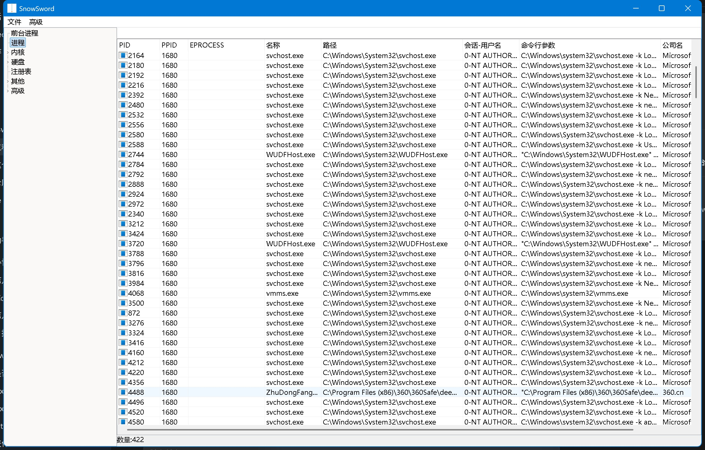
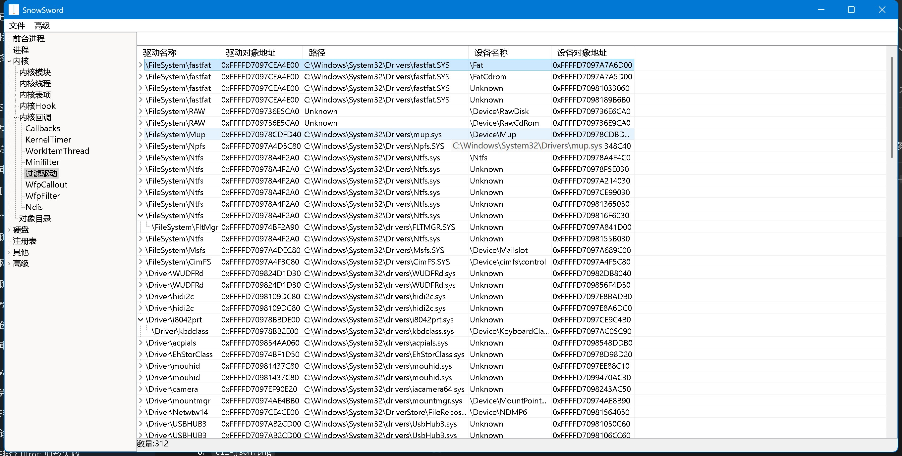
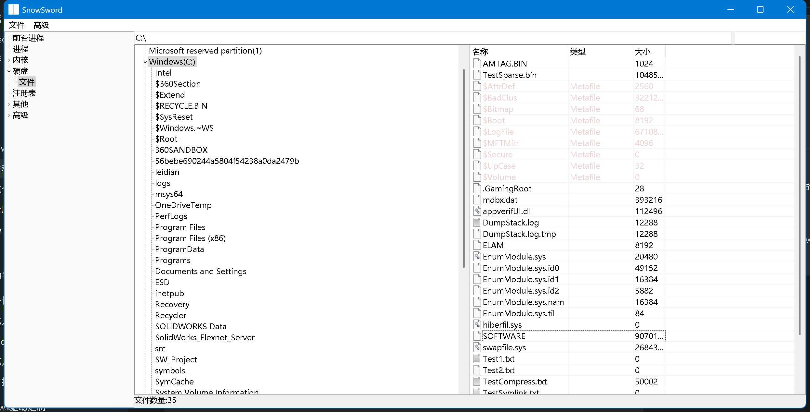
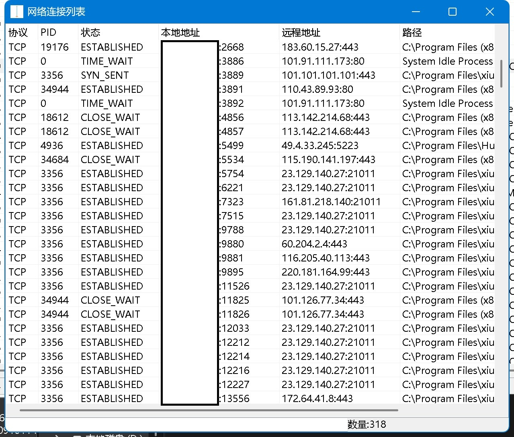
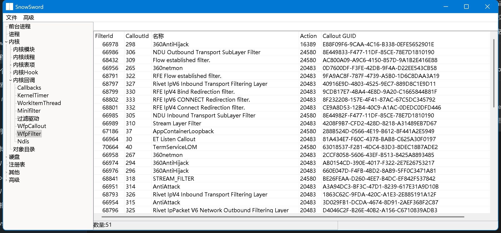
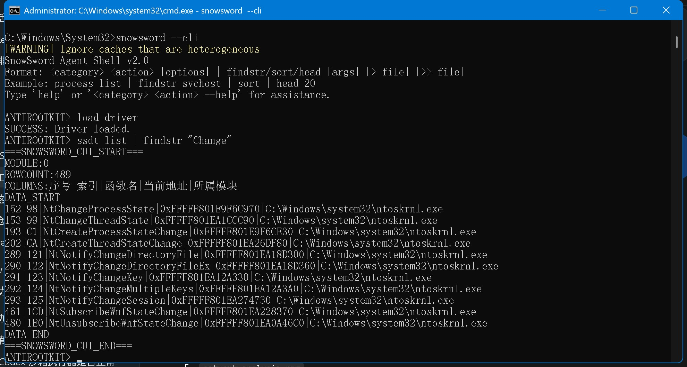

# SnowSword

**Windows 10/11 x64 Kernel Analysis & Anti-Rootkit Toolkit**

**English** | [简体中文](README.md)


SnowSword is a Windows kernel analysis and Anti-Rootkit toolkit built around a **Ring0 kernel driver** and a **Ring3 GUI/CLI**. It is intended for Windows kernel development, security research, rootkit detection, reverse engineering and low-level system analysis.

The project covers hidden process/driver detection, kernel callbacks, SSDT / Shadow SSDT, IDT / GDT, inline hooks, Minifilter, WFP, NTFS / FAT32, process memory and other Windows Internals topics.

## Highlights

- Hidden process and hidden driver detection
- Kernel module and kernel thread enumeration
- SSDT / Shadow SSDT inspection
- IDT / GDT inspection
- Kernel callback enumeration
- Driver Object / IRP Dispatch / Attached Device inspection
- Inline hook detection
- Minifilter and legacy file-system filter inspection
- WFP filter / callout and NDIS-related inspection
- TCP / UDP connection enumeration and hidden connection detection
- NTFS parsing, FAT32 enumeration and raw sector I/O
- Process memory read/write and memory-region inspection
- Registry inspection and offline Hive analysis
- GUI, CLI, JSON output and Agent Pipe mode

## Architecture

```text
┌─────────────────────────────────────────┐
│ Ring3                                    │
│ VisualFreeBasic GUI / CLI / Agent       │
└───────────────────┬─────────────────────┘
                    │ DeviceIoControl / IOCTL
                    ▼
┌─────────────────────────────────────────┐
│ Ring0                                    │
│ Windows Kernel Driver (C / WDK)         │
└───────────────────┬─────────────────────┘
                    │ Kernel APIs / internals
                    ▼
┌─────────────────────────────────────────┐
│ Windows Kernel / Drivers / File System  │
└─────────────────────────────────────────┘
```

## Screenshots

### Main Window and Process List

The main window displays processes, PIDs, parent processes, paths, session users, command lines and company information.



### Kernel Filter Analysis

Inspect file-system filter drivers, device objects and driver objects.



### File-System Analysis

Browse file-system objects and inspect file attributes, physical disks and low-level file information.



### Network Connection Analysis

Inspect TCP/UDP connections, connection states, process IDs and associated paths.



### WFP Filter Analysis

Inspect WFP filters and callouts, including names, actions and GUIDs.



### CLI and SSDT Query

Use the CLI/Agent Shell to load the driver and query SSDT data, with help output and pipeline filtering support.



## Quick Start

### Option 1: Prebuilt release (recommended)

1. Download the latest `SnowSword-vX.Y.Z-x64.zip` (or `.7z`) from [Releases](https://github.com/user-lzy/SnowSword/releases) and extract it.
2. Make sure `SnowSword.exe`, `SnowSword.sys` and the bundled `dbghelp.dll` / `symsrv.dll` are in the same directory.
3. Run `SnowSword.exe` **as administrator** and load the driver when prompted to use the kernel-related features.

### Option 2: Build from source

See [Build Environment](#build-environment) below to build the Ring0 driver and the Ring3 GUI.

### Driver loading notes

- The project uses a kernel driver, so administrator privileges are required. Loading an unsigned or test-signed driver usually requires disabling Secure Boot and enabling test signing (`bcdedit /set testsigning on`), or providing a valid digital signature, depending on your system policy.
- Run it inside a **VM with snapshots** or on a dedicated test machine rather than a production system.
- Unload the driver when you are done, and reboot if necessary.

> ⚠️ Use it only in **authorized environments** for Windows kernel development, security research and system diagnostics.

## Compatibility

| Windows version | Status |
|---|---|
| Windows 10 1607 ~ 22H2 | Supported |
| Windows 11 21H2 ~ 24H2 | Supported |
| Other Windows versions | Not sufficiently tested |

- Current target architecture: **x64**.
- Some modules rely on undocumented Windows kernel implementation details or runtime pattern scanning, so Windows updates may affect individual features.

## Build Environment

### Ring0 Driver

- Visual Studio 2022
- Windows Driver Kit (WDK)
- x64 target

Open `ring0/SnowSword.sln`, select an x64 Debug or Release configuration, and build `SnowSword.sys`.

### Ring3 GUI / CLI

- VisualFreeBasic 5.9.7
- WinFBX
- x64 target (`-gen gas64`)

Open `ring3/SnowSword.ffp` in VisualFreeBasic and build `SnowSword.exe` with the 64-bit configuration.

## CLI Examples

```text
SnowSword.exe --cli
SnowSword.exe -c "process list"
SnowSword.exe -c "thread list --pid <PID>"
SnowSword.exe --format JSON ...
SnowSword.exe --agent-pipe <name>
```

The CLI interface is still under active development, so available commands may change.

## Releases

The latest build is available on the [Releases](https://github.com/user-lzy/SnowSword/releases) page. Gitee is the client update source and GitHub is a mirror; both platforms keep the same tags and assets.

A release package (`SnowSword-vX.Y.Z-x64.zip` / `.7z`) typically contains:

- `SnowSword.exe`
- `SnowSword.sys`
- `dbghelp.dll`
- `symsrv.dll`
- `SHA256SUMS.txt`

The client update check reads [`version.json`](version.json) in the repository root (version, `exe_url` / `sys_url` and update log). The source repository does not keep `bin/`, build artifacts or release-sync scripts; build and verify both components before uploading assets to the matching Release on Gitee and GitHub.

## Project Structure

```text
SnowSword/
├─ ring0/                 # Windows kernel driver (C / WDK)
│  ├─ include/
│  ├─ sources/
│  └─ SnowSword.sln
├─ ring3/                 # GUI / CLI (VisualFreeBasic)
│  ├─ forms/
│  ├─ modules/
│  ├─ TreeList/
│  └─ images/
├─ docs/images/           # README screenshots
├─ version.json           # client update metadata
├─ README.md
├─ README_EN.md
└─ LICENSE
```

## Relevant Topics

SnowSword may be useful as a reference if you are working on:

- Windows Kernel Development
- Windows Internals
- Anti-Rootkit / Rootkit Detection
- Kernel Security / Kernel Integrity
- Windows Driver Development
- Reverse Engineering
- Malware Analysis
- Digital Forensics
- NTFS / FAT32 Internals
- Minifilter / WFP / NDIS
- Kernel Callback / SSDT / IDT / GDT

## Project Status

SnowSword is under active development and refactoring. Some functionality touches undocumented kernel behavior, so compatibility can vary between Windows builds.

> **UI language:** The GUI / CLI is currently **Simplified Chinese only**. English UI support is requested in [Issue #1](https://github.com/user-lzy/SnowSword/issues/1) and is not scheduled yet. English documentation is available in [README_EN.md](README_EN.md).

When reporting a problem, please include the Windows version and full build number, SnowSword version or commit SHA, the affected module, relevant error codes/logs/WinDbg output, and minimal reproduction steps.

## License

SnowSword is released under the [MIT License](LICENSE).

## Disclaimer

SnowSword is intended for **Windows kernel development, security research, malware analysis and authorized system diagnostics**. Do not use it for unauthorized access or other unlawful activity. Kernel-level experimentation may cause system crashes or data loss; use an isolated test environment whenever appropriate.
